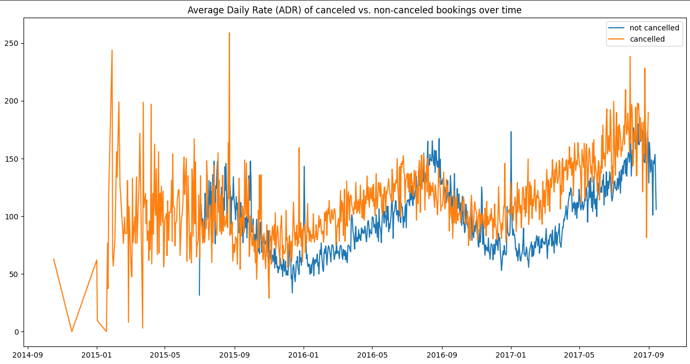
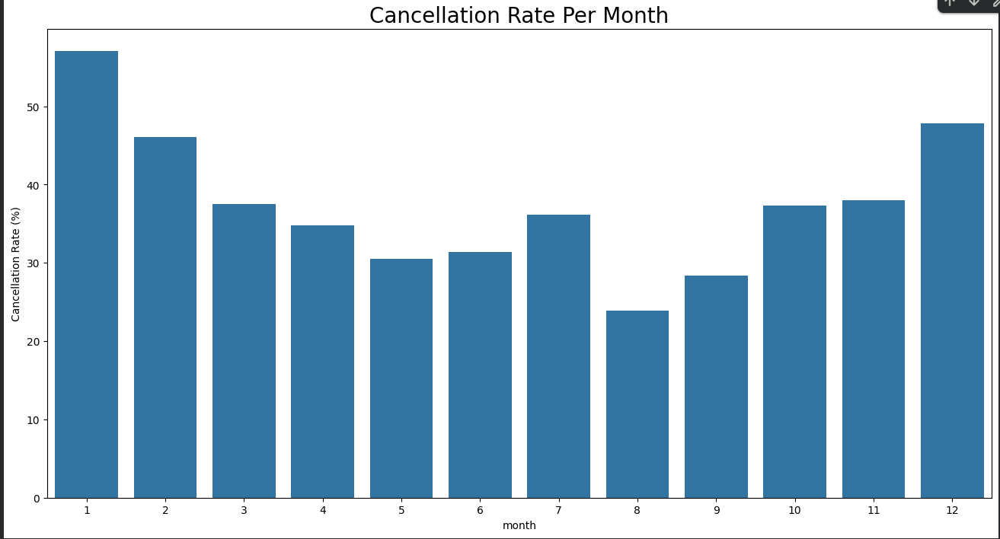
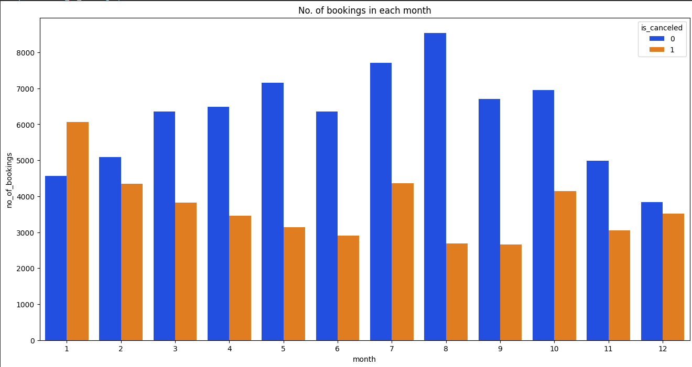
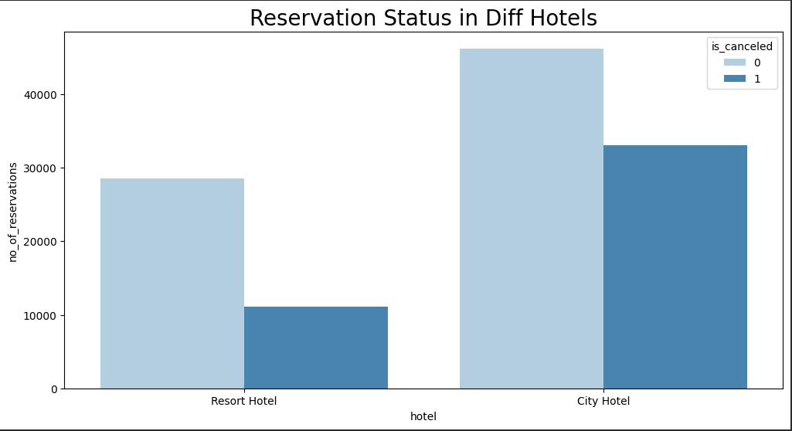

# 🏨 Hotel Booking Cancellation & Revenue Analysis

## 📌 Project Overview

This project analyzes **119,000+ hotel booking records** to identify booking patterns, cancellation behavior, pricing trends, and factors associated with hotel cancellations.

The analysis was performed using **Python, Pandas, NumPy, Matplotlib, and Seaborn**.

The goal is to understand **why bookings are being cancelled and which factors are associated with higher cancellation rates**, helping hotels improve booking strategies and reduce cancellations.

---

## 🎯 Business Objectives

- Analyze overall hotel booking and cancellation patterns.
- Compare cancellation behavior between City Hotels and Resort Hotels.
- Identify months with higher cancellation rates.
- Analyze Average Daily Rate (ADR) trends.
- Identify countries with the highest number of cancellations.
- Analyze cancellation patterns across different market segments.
- Examine the relationship between booking channels and cancellations.
- Identify potential areas for improving booking and revenue strategies.

---

## 🛠️ Technologies Used

- **Python**
- **Pandas** – Data cleaning and analysis
- **NumPy** – Numerical operations
- **Matplotlib** – Data visualization
- **Seaborn** – Statistical visualization
- **Jupyter Notebook / Google Colab**

---

## 📊 Dataset

The dataset contains hotel booking information such as:

- Hotel type
- Booking status
- Reservation status
- Reservation status date
- Arrival month
- ADR (Average Daily Rate)
- Country
- Market segment
- Deposit type
- Customer type
- Lead time
- Number of guests
- Previous cancellations

The dataset contains approximately **119,000 booking records**.

---

## 🔍 Analysis Performed

### 1. Hotel-wise Cancellation Analysis

Compared cancellation behavior between:

- Resort Hotel
- City Hotel

City Hotels showed a higher cancellation rate than Resort Hotels.

---

### 2. Monthly Cancellation Rate

Calculated the percentage of bookings cancelled in each month.

The analysis revealed significant variation in cancellation rates across different months.

---

### 3. ADR Analysis

Analyzed **Average Daily Rate (ADR)** across different periods and compared ADR trends between:

- Cancelled bookings
- Non-cancelled bookings
- City Hotels
- Resort Hotels

---

### 4. Market Segment Analysis

Analyzed booking distribution and cancellation behavior across different market segments, including:

- Online Travel Agents
- Offline Travel Agents
- Groups
- Direct
- Corporate
- Complementary
- Aviation

Online Travel Agents represented the largest booking segment and showed a higher cancellation rate than Offline Travel Agents.

---

### 5. Country-wise Cancellation Analysis

Identified the countries contributing the highest number of cancelled bookings.

---

## 📈 Key Insights

- **City Hotels** had a higher cancellation rate (**41.7%**) compared with **Resort Hotels (28.0%)**.
- **Online Travel Agents** had a higher cancellation rate (**46%**) compared with **Offline Travel Agents (23%)**.
- Cancellation rates varied significantly across months.
- Online Travel Agents represented the largest market segment.
- ADR showed noticeable seasonal variation over time.
- Cancellation behavior differs across hotel types, booking channels, and customer segments.

---

## 📊 Visualizations

### ADR: Cancelled vs Non-Cancelled Bookings



### Cancellation Rate Per Month



### Bookings by Month and Cancellation Status



### Reservation Status by Hotel



---

## 💡 Business Recommendations

- Higher ADR appears to be associated with higher cancellation levels in the analysis. Hotels can experiment with targeted pricing strategies, promotional offers, and discounts for high-risk bookings rather than applying blanket price reductions.

- City Hotels showed a higher cancellation rate (41.7%) than Resort Hotels (28.0%). City Hotels should focus on flexible pricing, targeted offers, and cancellation-prevention strategies to improve booking retention.

- January recorded the highest cancellation rate among the analyzed months. Hotels can introduce targeted marketing campaigns, promotional packages, and attractive offers during this period to improve booking conversion and revenue.

- Online Travel Agents showed a higher cancellation rate (46%) than Offline Travel Agents (23%). Hotels should review OTA booking policies, improve communication with customers, and introduce incentives for confirmed bookings to reduce cancellations.

- Portugal accounted for the largest share of cancellations among the countries analyzed. Hotels operating in this market should investigate customer preferences, pricing, service quality, and booking-channel behavior before implementing targeted retention strategies.

---

## 📁 Project Structure

```text
Hotel-booking-analysis/
│
├── Hotel_Booking_Analysis.ipynb
├── README.md
├── requirements.txt
│
└── Images/
    ├── 01_adr_cancelled_vs_non_cancelled.png
    ├── 02_top_10_countries_cancellations.png
    ├── 03_cancellation_rate_per_month.png
    ├── 04_bookings_by_month_and_status.png
    ├── 05_adr_by_hotel.png
    └── 06_reservation_status_by_hotel.png
